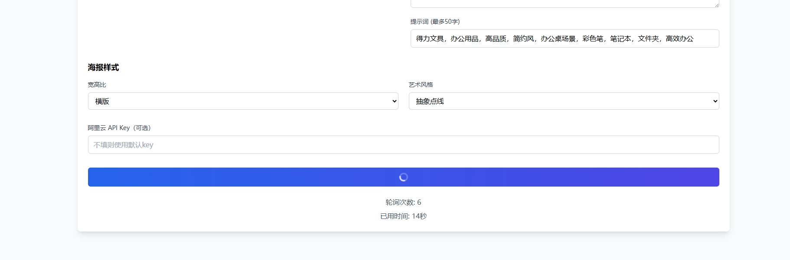
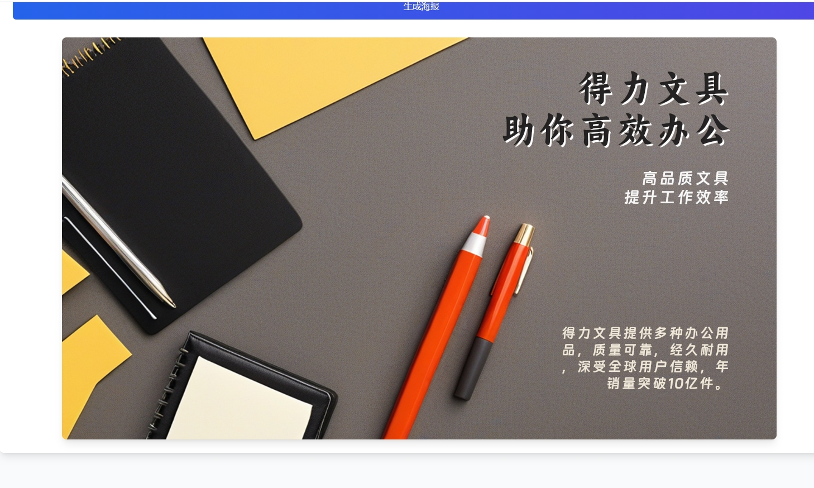

# AI海报生成器

基于阿里云百炼平台文生图能力的智能海报生成工具，支持自定义标题、副标题、正文内容和艺术风格，快速生成精美的营销海报。

## 功能特点

- 🎨 支持多种艺术风格选择
  - 2D插画风格
  - 浩瀚星云
  - 中国水墨
  - 剪纸工艺
  - 等多种风格可选
- 📝 灵活的内容定制
  - 自定义标题
  - 自定义副标题
  - 自定义正文内容
  - 自定义提示词
- 📐 支持多种尺寸比例
  - 横版海报
  - 竖版海报
- 🖼️ 图片预览功能
  - 点击图片可查看大图
  - 支持图片放大预览
- ⏱️ 实时生成状态
  - 显示轮询次数
  - 显示生成耗时
  - 实时状态更新

## 示例效果







## 技术栈

- 后端：FastAPI
- 前端：HTML + TailwindCSS
- API：阿里云百炼平台文生图能力
- 异步处理：httpx

## 部署方式

### 方式一：直接部署

1. 克隆项目
```bash
git clone [项目地址]
cd poster
```

2. 安装依赖
```bash
pip install -r requirements.txt
```

3. 运行服务
```bash
python app.py
```

4. 访问应用
打开浏览器访问 `http://localhost:8000`

### 方式二：Docker 部署

1. 确保已安装 Docker 和 Docker Compose

2. 克隆项目
```bash
git clone [项目地址]
cd poster
```

3. 构建并启动容器
```bash
docker-compose up -d
```

4. 访问应用
打开浏览器访问 `http://localhost:8000`

5. 查看容器状态
```bash
docker-compose ps
```

6. 查看容器日志
```bash
docker-compose logs -f
```

7. 停止服务
```bash
docker-compose down
```

## 使用说明

1. 填写海报内容
   - 输入标题
   - 输入副标题
   - 输入正文内容
   - 输入提示词（可选）

2. 选择海报样式
   - 选择宽高比（横版/竖版）
   - 选择艺术风格

3. 输入阿里云 API Key
   - 在阿里云控制台获取 API Key
   - 填入 API Key 输入框

4. 生成海报
   - 点击"生成海报"按钮
   - 等待生成完成
   - 查看生成结果

## 注意事项

- 需要有效的阿里云 API Key
- 生成过程可能需要一定时间，请耐心等待
- 建议使用现代浏览器访问
- Docker 部署时确保 8000 端口未被占用

## 依赖要求

- Python 3.7+
- FastAPI
- uvicorn
- httpx
- jinja2
- python-multipart
- python-dotenv

## 许可证

MIT License

## 联系方式

如有问题或建议，请提交 Issue 或联系开发者。 